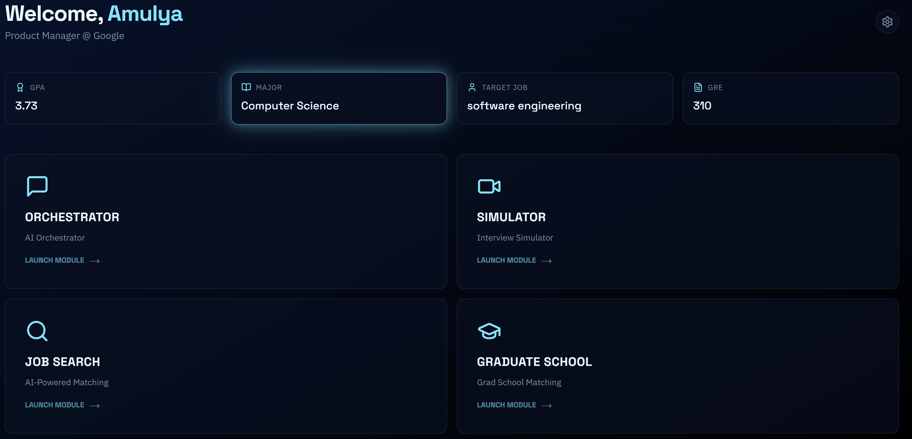

<h1>Elevatr</h1>

Elevatr is an AI-powered platform designed to streamline career growth through personalized job discovery, resume optimization, and graduate school preparation. It features a modern React frontend and a modular Python backend driven by an intelligent orchestrator.  
   
Key Features
* Intelligent Orchestrator: Uses LLMs to decompose user queries into specific tasks (e.g., Find a job and update my resume).
* Direct-to-Source Job Scraper: Scrapes ATS platforms (Greenhouse, Lever, LinkedIn) for verified, real-time listings.
* Skill Gap Analysis: Compares user profiles against job requirements to identify missing competencies.
* AI Resume Builder: Generates tailored resume bullets based on target career goals.
* Responsive Dashboard: A sleek, high-performance UI built with Vite, React, and Tailwind CSS.

Tech Stack
Frontend
* Framework: React 18 (TypeScript)
* Build Tool: Vite
* Styling: Tailwind CSS and Framer Motion
* UI Components: Radix UI and Shadcn/UI
* State Management: TanStack Query (React Query)

Backend
* API Framework: FastAPI
* LLM Orchestration: LangChain
* Databases: MongoDB (Profiles/History) and Redis (Session Cache)
* Vector Store: ChromaDB

Prerequisites
* Node.js: 18.0 or higher
* Python: 3.10 or higher
* Databases: MongoDB and Redis instances running locally or in the cloud.

Installation and Setup
Backend Setup Navigate to the backend folder. Run: python -m venv venv Run: source venv/bin/activate (On Windows use: venv\Scripts\activate) Run: pip install -r requirements.txt

Create a .env file in the /backend folder with these values: 
 
MONGO_URI=""
 
DB_NAME=""
  
REDIS_HOST="" 
REDIS_PORT=11904 
REDIS_USER="" 
REDIS_PASS="" 

OPENAI_API_KEY=""

JWT_SECRET="" 
GOOGLE_API_KEY="" 
VITE_AZURE_SPEECH_KEY="" 

VITE_AZURE_SPEECH_REGION="eastus" 
NLP_KEY = "" 
ADZUNA_API_KEY="" 
ADZUNA_APP_ID="” 
USAJOBS_API_KEY="" 
USAJOBS_USER_AGENT="" 

Frontend Setup Navigate to the frontend folder. Run: npm install

Running the Project

Start the Backend Navigate to the backend folder and run: python -m uvicorn main:app --reload 
Start the Frontend Navigate to the frontend folder and run: npm run dev

Project Architecture
1. Frontend (/src): Uses a component-based architecture with Radix UI primitives for accessibility and Tailwind for custom Elevatr branding.
2. Orchestrator (orchestrator.py): The central hub that takes a user query, retrieves the profile from MongoDB, and triggers parallel modules via asyncio.
3. Job Search (job_search.py): A specialized scraper that avoids job aggregators and hits company-direct career pages for higher data quality.
4. Database Layer (database.py): Implements dual-persistence, using Redis for ephemeral chat context and MongoDB for long-term data.
5. Inspection (inspect_chroma.py): A utility to verify the health and document count of the local job vector database.
